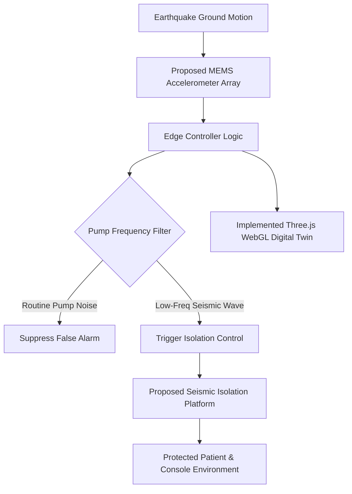
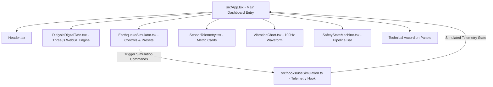

# ESDS — Earthquake-Resilient Dialysis Safety System
> **An Engineering Concept and Software MVP for an Earthquake-Resilient Patient & Dialysis Equipment Protection Platform**  
> *Smart India Hackathon (SIH) — Technical & Innovation Project Report*

---

> ### ⚠️ OFFICIAL DISCLAIMER & COMPLIANCE NOTICE
> **ESDS is currently a software MVP and conceptual engineering proposal.**  
> The earthquake signals, sensor telemetry, motion calculations, isolation performance metrics, and 3D visual responses rendered in the digital twin are **computationally simulated parameters created for concept visualization**. The software is **not connected to, nor controlling, physical hardware or medical equipment**. ESDS is **not a certified medical device** and has not undergone physical shake-table validation or clinical testing. Any future physical deployment would require extensive structural, mechanical, electrical, biomedical, safety, regulatory, and clinical validation.

---

## 📌 Classification Legend

To ensure complete transparency for SIH evaluators, technical judges, and mentors, all technical statements in this report are categorized using the following status markers:

- 🟢 **`[IMPLEMENTED]`**: Features fully functional and verifiable in the current software source code repository.
- 🟡 **`[SIMULATED]`**: Implemented digitally for demonstration, but calculated via software equations rather than physical hardware.
- 🔵 **`[PROPOSED]`**: Engineering designs, candidate architectures, or hardware specifications planned for physical prototyping.
- 🔴 **`[NOT VALIDATED]`**: Engineering targets, theoretical estimates, or safety claims requiring physical laboratory or clinical testing.

---

## 📊 Current Software MVP vs. Future Physical System

| Feature / Capability | Current Software MVP 🟢 🟡 | Future Physical System 🔵 🔴 |
| :--- | :--- | :--- |
| **Project Status** | Software Concept Demonstration 🟢 | Physical Prototype & Hardware Rig 🔵 |
| **Earthquake Input** | Computational Math Signal (Sum of Sines) 🟡 | Real Ground Acceleration / Shake Table 🔵 |
| **Seismic Sensor Data** | Simulated Telemetry Loop (`useSimulation.ts`) 🟡 | Physical MEMS / Industrial IMU Sensors 🔵 |
| **3D Digital Twin Engine** | Interactive Three.js / WebGL Rendering 🟢 | Hardware-Synchronized Telemetry Twin 🔵 |
| **Pod & Equipment Motion** | Procedural 3D Mesh Kinematics 🟢 | Physical Mechanical Isolation Platform 🔵 |
| **Seismic Isolation** | Illustrative $85\%$ Software Attenuation Factor 🟡 | Physical Dampers & Isolators 🔴 |
| **Isolation Actuation** | Animated Isolator Pistons ($D1$–$D4$) 🟢 | Active/Passive Dampers or Servos 🔵 |
| **Signal Detection** | TypeScript Logic & Thresholding 🟢 | Embedded Real-Time MCU Firmware (ESP32/STM32) 🔵 |
| **Vibration Waveform** | HTML5 Canvas $100 \text{ Hz}$ Oscilloscope 🟢 | Real Sensor Telemetry Stream 🔵 |
| **Patient & Console** | 3D Procedural Mesh Representations 🟢 | Physical Dialysis Bed & Hemodialysis Console 🔵 |
| **Performance Validation** | Software UI Verification 🟢 | Shake-Table & Clinical Lab Validation 🔴 |

---

## 📋 Executive Summary

The **Earthquake-Resilient Dialysis Safety System (ESDS)** is an engineering concept and software demonstration designed to explore methods for protecting hemodialysis patients and critical medical consoles during seismic events.

During an earthquake, unmitigated floor acceleration travels directly into hospital furniture and equipment. For hemodialysis patients—who remain connected to an extracorporeal blood circuit via vascular access (AV fistula, graft, or central catheter) for 3 to 4 hours per session—sudden displacement of either the patient chair or the dialysis console introduces severe mechanical risks.

ESDS proposes a **layered seismic protection architecture** combining floor acceleration sensing, edge decision logic, a mechanical isolation layer, and a real-time **Three.js WebGL Digital Twin**.

```
PROPOSED SEISMIC PROTECTION PIPELINE:

EARTHQUAKE GROUND MOTION
        │
        ▼
[ SEISMIC ACCELEROMETER ARRAY ] ─── 🔵 Proposed Hardware (MEMS IMU)
        │
        ▼
[ EDGE DECISION ENGINE ] ────────── 🟢 Implemented Software Logic / 🔵 Proposed MCU Firmware
        │
        ▼
[ SEISMIC ISOLATION PLATFORM ] ──── 🟡 Simulated $85\%$ Attenuation / 🔵 Proposed Physical Isolators
        │
        ▼
[ PROTECTED PATIENT & CONSOLE ] ─── 🟢 3D WebGL Digital Twin Representation
```

The current **Software MVP** provides an interactive split-screen demonstration comparing an **UNPROTECTED (WITHOUT ESDS)** setup versus a **PROTECTED (WITH ESDS)** setup under identical simulated earthquake signals.

---

## 🎯 Problem Statement

During seismic events, ground acceleration creates multi-axis forces that can cause unanchored objects to shift, vibrate, or overturn.

```
┌──────────────────────────────────────────────────────────────────────────────────┐
│                             CONVENTIONAL DIALYSIS SETUP                          │
│                                                                                  │
│   SEISMIC INPUT ──► HOSPITAL FLOOR ──► MACHINE DISPLACEMENT ──► TUBING TENSION   │
│                                                                                  │
│                               POTENTIAL RISKS:                                   │
│          • Dialysis Console Sliding / Tipping Risk                               │
│          • Tubing Stress & Vascular Access Displacement Risk                     │
│          • Treatment Interruption & Staff Emergency Overload                     │
└──────────────────────────────────────────────────────────────────────────────────┘
```

### Problem Context Across Three Perspectives

#### 1. Patient Considerations
Hemodialysis requires continuous blood circulation outside the body at flow rates of $300–450 \text{ mL/min}$. Differential motion between the patient's arm and the dialysis console may create mechanical tension on blood lines, potentially increasing the risk of tubing displacement or access-site complications.

#### 2. Equipment Integrity Considerations
Hemodialysis consoles are tall, top-heavy units (weighing $80–120 \text{ kg}$) housing fluidic pumps, dialysate heaters, and sensitive sensors. Uncontrolled floor shaking may cause equipment to slide, tilt, or collide with adjacent walls, potentially leading to fluid leaks, sensor misalignment, or mechanical failure.

#### 3. Facility Operational Continuity
During an earthquake, medical staff must handle patient reassurance, structural evaluation, and emergency procedures simultaneously. An automated seismic protection layer is intended to reduce mechanical transmission automatically, mitigating staff cognitive workload during emergency responses.

*Note: ESDS is an engineering concept intended to reduce mechanical transmission; all clinical claims represent theoretical design targets requiring physical validation.* 🔴

---

## 💡 Proposed Solution Architecture

ESDS is conceptualized as a multi-tiered safety system:



### Protection Layers (Implemented vs. Proposed)

1. **Seismic Sensing**: 🔵 Proposed tri-axial MEMS accelerometers on building floors measuring acceleration at $100 \text{ Hz}$. (🟡 Currently simulated via computational math functions).
2. **Signal Filtering**: 🟢 Implemented software filter logic separating low-frequency seismic motion ($0.5–10 \text{ Hz}$) from high-frequency dialyzer pump vibration ($20–30 \text{ Hz}$).
3. **Threshold Detection**: 🟢 Implemented logic triggering an emergency response state when simulated dynamic acceleration exceeds $0.25\text{g}$.
4. **Mechanical Isolation**: 🔵 Proposed physical isolators (MR dampers, viscous dampers, or elastomeric mounts). (🟡 Currently modeled in software as an illustrative $85\%$ motion reduction).
5. **Digital Twin Visualization**: 🟢 Implemented Three.js WebGL control panel rendering live 3D representations, waveforms, and telemetry analytics.

---

## 🛠️ Current Software MVP — Audit of Repository Features

An audit of the actual codebase (`src/App.tsx`, `DialysisDigitalTwin.tsx`, `useSimulation.ts`, etc.) reveals the following verifiable implementations:

| Feature / Component | Source Location | Classification | Functional Description |
| :--- | :--- | :--- | :--- |
| **Three.js 3D Digital Twin** | `DialysisDigitalTwin.tsx` | 🟢 `[IMPLEMENTED]` | Interactive WebGL 3D rendering of capsule, bed, 3D patient model, console, IV bags, blood tubing, and isolator mounts. |
| **Split-Screen Compare Mode** | `DialysisDigitalTwin.tsx` | 🟢 `[IMPLEMENTED]` | Dual WebGL viewports rendering UNPROTECTED vs. PROTECTED models animating synchronously. |
| **Seismic Kinematics Engine** | `DialysisDigitalTwin.tsx` | 🟢 `[IMPLEMENTED]` | Deterministic multi-harmonic wave generator supporting NORMAL, MODERATE (55%), SEVERE (88%), and PUMP VIBRATION modes. |
| **Smooth Damping & Ramp** | `DialysisDigitalTwin.tsx` | 🟢 `[IMPLEMENTED]` | Fast $0.3\text{s}$ lerp ramp-up and $0.5\text{s}$ damped return-to-neutral upon reset. |
| **Live Vibration Waveform** | `VibrationChart.tsx` | 🟢 `[IMPLEMENTED]` | HTML5 Canvas $100 \text{ Hz}$ oscilloscope plotting dynamic acceleration against a $0.25\text{g}$ threshold. |
| **Telemetry Dashboard** | `SensorTelemetry.tsx` | 🟢 `[IMPLEMENTED]` | Displays dynamic acceleration $(g)$, floor motion $(\%)$, pod motion $(\%)$, and isolation efficiency $(\%)$. |
| **Automated Safety Pipeline** | `SafetyStateMachine.tsx` | 🟢 `[IMPLEMENTED]` | 5-step visual pipeline (`MONITOR` $\rightarrow$ `DETECT` $\rightarrow$ `ISOLATE` $\rightarrow$ `PROTECT` $\rightarrow$ `SECURE`). |
| **False Positive Demo** | `FalsePositiveDemo.tsx` | 🟢 `[IMPLEMENTED]` | Visual demonstration of filtering dialyzer pump frequency noise to prevent false emergency triggers. |
| **Synthetic Sensor Telemetry** | `useSimulation.ts` | 🟡 `[SIMULATED]` | Telemetry values generated via TypeScript state functions for MVP demonstration. |
| **Physical Isolation Dampers** | N/A | 🔵 `[PROPOSED]` | Hardware dampers (MR fluid / elastomeric) proposed for future physical fabrication. |
| **Physical Controller Board** | N/A | 🔵 `[PROPOSED]` | Embedded ESP32/STM32 controller hardware proposed for physical testing. |
| **Measured Isolation Efficiency** | N/A | 🔴 `[NOT VALIDATED]` | Physical attenuation percentage requiring experimental shake-table testing. |

---

## 🌐 Three.js 3D Digital Twin Architecture

The 3D Digital Twin (`src/components/DialysisDigitalTwin.tsx`) provides a visual software model of the proposed capsule and isolation structure:

```
┌─────────────────────────────────────────────────────────────┐
│               TRANSPARENT GLASS CANOPY SHELL                │
│                                                             │
│   ┌─────────────────────┐       ┌───────────────────────┐   │
│   │  PATIENT & BED      │======═│  DIALYSIS MACHINE     │   │
│   │  (Safety Zone)      │ Tubing│  (Pump & Screen)      │   │
│   └─────────────────────┘       └───────────────────────┘   │
└─────────────────────────────────────────────────────────────┘
===============================================================
│  [D1]         [D2]               [D3]         [D4]          │ ◄── Visual Isolators (Damped Piston Motion)
└─────────────────────────────────────────────────────────────┘
─────────────────────────────────────────────────────────────── ◄── Simulated Ground Grid
```

### 3D Scene Component Hierarchy 🟢

- **Capsule Frame & Glass Shell**: Cylinder geometry with a PBR physical glass material (`MeshPhysicalMaterial`, transmission $0.85$, opacity $0.35$).
- **Articulated Bed & Patient**: Multi-part treatment bed housing a procedural 3D anatomical human figure with head, torso, arm, gown, and blanket geometries.
- **Hemodialysis Console**: Equipment housing featuring an active LCD status display (2D canvas texture), IV pole, saline/blood bags, dialyzer filter cylinder, and rotating peristaltic pump rotor.
- **Extracorporeal Blood Lines**: 3D curved tube geometries (`TubeGeometry` with Catmull-Rom paths) connecting console to patient arm.
- **Seismic Base & Isolators ($D1–D4$)**: Dual-deck platform with four isolator units featuring chrome piston shafts, spring coils (`TubeGeometry`), and status LED rings.
- **Orbit Controls & Camera**: Interactive mouse drag orbiting (radius $14.5$ in single view, $17.5$ in compare view) preventing 3D mesh clipping.

---

## 📊 Seismic Simulation & Kinematics Engine

The animation loop in `DialysisDigitalTwin.tsx` calculates real-time mesh positions using deterministic wave functions rather than random jitter.

### Computational Simulation Equations 🟡

#### 1. Multi-Harmonic Wave Equation
Ground acceleration is simulated using a combination of sine waves:

$$\text{Wave}(t) = 0.45 \sin(18t) + 0.25 \sin(31t) + 0.12 \sin(47t)$$

Where $t$ is elapsed time in seconds.

#### 2. Unprotected Model Motion (Left Viewport)
The unprotected model follows simulated floor motion directly, combined with high-frequency kinetic vibration:

$$A_{\text{floor}} = \max\left(0.35, \frac{\text{FloorMotion}}{100} \cdot 2.0\right) \cdot R(t)$$

$$X_{\text{unprotected}}(t) = 1.8 \cdot \text{Wave}(t) \cdot A_{\text{floor}} + \left(0.35 \sin(36t) + 0.22 \cos(54t)\right) A_{\text{floor}}$$

$$Y_{\text{unprotected}}(t) = \left(0.20 \sin(42t) + 0.12 \cos(26t)\right) A_{\text{floor}}$$

$$\Theta_{\text{unprotected}}(t) = \left(0.10 \sin(28t) + 0.06 \cos(46t)\right) A_{\text{floor}}$$

Where $R(t)$ is the lerp ramp factor ($0.0 \rightarrow 1.0$).

#### 3. Protected Model Motion (Right Viewport)
The protected model uses an illustrative $0.15$ motion factor to represent conceptual isolation:

$$X_{\text{protected}}(t) = 0.15 \cdot \text{Wave}(t) \cdot A_{\text{floor}}, \quad Y_{\text{protected}}(t) = 0, \quad \Theta_{\text{protected}}(t) = 0$$

#### 4. Isolator Piston Stroke
Isolator pistons ($D1–D4$) animate in phase with relative displacement:

$$\text{Stroke}_{\text{piston}}(t) = \left(X_{\text{floor}}(t) - X_{\text{protected}}(t)\right) \cdot 0.45$$

*Important Note: These calculations represent simulation parameters used for software visualization and do NOT represent measured physical sensor data.* 🟡

---

## ⚖️ Protected vs. Unprotected Comparison

In **Compare Mode**, ESDS renders two live 3D WebGL viewports side-by-side:

```
┌───────────────────────────────────────┬───────────────────────────────────────┐
│     WITHOUT ESDS (UNPROTECTED) 🟡     │       WITH ESDS (PROTECTED) 🟡        │
│                                       │                                       │
│   • Pod Motion: HIGH (e.g. 47%)       │   • Pod Motion: LOW (e.g. 7%)         │
│   • Simulated Vibration: Unmitigated  │   • Simulated Vibration: Attenuated   │
│   • Dampers: Disabled (OFF)           │   • Dampers: Active (D1-D4 Engaged)   │
│   • Visual State: High Motion Risk    │   • Visual State: Stabilized Pod      │
└───────────────────────────────────────┴───────────────────────────────────────┘
```

### Transmissibility Concept 🔵 🔴

In mechanical engineering, transmissibility ($T$) is defined as:

$$T = \frac{\text{Transmitted Acceleration}}{\text{Input Acceleration}} = \sqrt{\frac{1 + (2\zeta r)^2}{(1 - r^2)^2 + (2\zeta r)^2}}$$

Where $r = \frac{\omega}{\omega_n}$ is the frequency ratio and $\zeta$ is the damping ratio.  
*Target Design Goal*: Achieve $T < 0.20$ ($>80\%$ attenuation) for frequencies above $3 \text{ Hz}$.  
*Current MVP Implementation*: Models an illustrative $0.15$ multiplier for visual software comparison. 🟡

---

## 🔬 Proposed Full-Scale Hardware Architecture 🔵

> *Notice: The hardware components described below represent candidate technologies for future engineering prototyping and are NOT physically built into the current software repository.*

```
┌─────────────────────────────────────────────────────────────────────────────────┐
│                    PROPOSED PHYSICAL HARDWARE CANDIDATES                        │
│                                                                                 │
│   [MEMS / IMU SENSORS] ──► [ESP32 / STM32 MCU] ──► [ISOLATION ACTUATORS]       │
│      (ADXL345 / MPU6050)      (Edge Controller)    (MR Dampers / Servos / Rubber)│
└─────────────────────────────────────────────────────────────────────────────────┘
```

### Candidate Technology Evaluation Matrix 🔵 🔴

| Hardware Layer | Candidate Technologies | Primary Function | Candidate Rationale | Limitations / Validation Required 🔴 |
| :--- | :--- | :--- | :--- | :--- |
| **Seismic Sensing** | ADXL345, MPU6050, Industrial MEMS IMU | Tri-axial floor acceleration measurement | Low cost, high sampling frequency ($100+\text{ Hz}$), $I^2C$/SPI interface. | Requires calibration against calibrated shake-table reference sensors. |
| **Edge Controller** | ESP32-WROOM, STM32F4, Industrial PLC | Sensor processing, thresholding, actuator signal output | Real-time processing, low power, integrated communications. | Requires deterministic RTOS task scheduling verification under sub-20ms targets. |
| **Fieldbus Comms** | CAN Bus 2.0B, RS-485, Industrial Ethernet | Low-latency interconnect between MCU and damper drivers | High noise immunity in clinical environments. | Cable routing and electromagnetic compatibility (EMC) testing required. |
| **Isolation Actuators** | Magnetorheological (MR) Dampers, Servo Drives, Viscous Dampers | Kinetic energy absorption and counter-phase displacement | Variable damping viscosity under magnetic fields (MR dampers). | High cost, power requirements, and fluid seal durability testing required. |
| **Passive Isolators** | High-damping Rubber Bearings, Steel Springs | Base structural isolation | Constant passive isolation without external power. | Potential resonance near natural frequency ($\omega_n$) without active damping. |

---

## 🏗️ Mechanical System Design Concept 🔵

```
  ┌─────────────────────────────────────────────────────────────┐
  │                 ISOLATED UPPER PLATFORM                     │  ◄── Candidate Steel Frame
  └─────────────────────────────────────────────────────────────┘
     ▲              ▲                         ▲              ▲
     │              │                         │              │
  [D1 Mount]    [D2 Mount]                 [D3 Mount]    [D4 Mount]  ◄── Candidate Isolator Units
     │              │                         │              │
  ┌─────────────────────────────────────────────────────────────┐
  │                   HEAVY BASE FRAME                          │  ◄── Anchored Base
  └─────────────────────────────────────────────────────────────┘
```

### Engineering Design Targets (Proposed) 🔵 🔴
- **Tuning Natural Frequency ($\omega_n$)**: Target $< 1.5 \text{ Hz}$ to isolate higher-frequency ground shaking ($3–10 \text{ Hz}$). 🔴
- **Overturning Stability**: Wide base footprint ($11.5 \text{ ft} \times 5.5 \text{ ft}$) designed to lower center of gravity and resist overturning moments. 🔴
- **Tubing Conduit Relief**: Flexible conduit bridge accommodating up to $\pm 150 \text{ mm}$ of lateral displacement to prevent strain on wall water/drain lines. 🔴
- **Fail-Safe Mechanical Stops**: Solenoid-actuated pins defaulting to locked position upon power loss. 🔴

---

## 🎛️ Proposed Closed-Loop Control System 🔵

```
                                PROPOSED CLOSED-LOOP CONTROL FLOW:

┌──────────────────┐           ┌──────────────────┐           ┌──────────────────┐
│  MEMS SENSOR     │           │  BAND-PASS FILTER│           │ THRESHOLD CHECK  │
│  Floor Accel.    │──────────►│  (0.5 - 10 Hz)   │──────────►│  a > 0.25g ?     │
└──────────────────┘           └──────────────────┘           └─────────┬────────┘
                                                                        │ YES
                                                                        ▼
┌──────────────────┐           ┌──────────────────┐           ┌──────────────────┐
│ STABILIZED REST  │           │ CLOSED-LOOP      │           │ ENGAGE DAMPER    │
│ Monitor Mode     │◄──────────│ FEEDBACK CONTROL │◄──────────│ ACTUATORS D1-D4  │
└──────────────────┘           └──────────────────┘           └──────────────────┘
```

### Detection Logic & Filter Strategy 🟢 🔵
Hemodialysis peristaltic blood pumps generate localized micro-vibrations at $20–30 \text{ Hz}$. ESDS implements band-pass filtering to isolate low-frequency ground motion ($0.5–10 \text{ Hz}$), preventing false alarms triggered by routine machine operation. 🟢

---

## 🤖 AI & Machine Learning — Future Scope 🔵

While the current MVP uses deterministic threshold logic, future physical iterations may evaluate edge AI capabilities:

- **P-Wave Early Warning Classification**: Convolutional Neural Networks (CNNs) analyzing initial seismic P-waves to estimate S-wave arrival magnitude. 🔵
- **Adaptive Damping Optimization**: Reinforcement learning algorithms dynamically adjusting damper currents based on patient weight and floor vibration profiles. 🔵
- **Predictive Maintenance**: Anomaly detection models analyzing isolator wear over long operational lifespans. 🔵

*Current MVP Status*: AI capabilities are strictly future research scope; no machine learning models are deployed in the current codebase. 🟢

---

## 💻 Software Architecture & Tech Stack



### Tech Stack Component Matrix 🟢

| Layer | Technology | Version | Purpose |
| :--- | :--- | :--- | :--- |
| **Framework** | React | `^18.3.1` | Component-based dashboard architecture. |
| **Language** | TypeScript | `^5.7.3` | Type-safe telemetry interfaces and state definitions. |
| **3D Rendering** | Three.js | `^0.185.1` | WebGL hardware-accelerated 3D Digital Twin rendering. |
| **Styling** | Tailwind CSS | `^3.4.17` | Responsive light medical UI styling. |
| **Icons** | Lucide React | `^0.475.0` | Vector dashboard UI icons. |
| **Build Tool** | Vite | `^6.1.0` | Fast development server & production compilation. |

---

## 🔐 Proposed Safety Architecture & Risk Mitigation 🔵 🔴

| Risk Scenario | Potential Impact | Proposed Mitigation Strategy 🔵 | Validation Needed 🔴 |
| :--- | :--- | :--- | :--- |
| **Power Failure** | Active actuators lose signal. | Dampers default to passive elastomeric isolation mode via mechanical lockouts. | Power drop testing on physical prototype. |
| **Sensor Malfunction** | Single sensor fails or drifts. | Triple-modular redundant (TMR) sensor voting algorithm. | Fault-injection simulation and physical testing. |
| **Excessive Displacement** | Floor motion exceeds stroke limit. | Elastomeric bumper stops prevent hard metal-to-metal impact. | High-amplitude shake table stroke testing. |
| **Communication Delay** | Fieldbus latency causes late response. | Hardware interrupt triggers bypassing network protocol. | Real-time latency bench testing ($< 20\text{ ms}$ target). |

---

## 🧪 Comprehensive Validation Strategy & Roadmap

Physical validation of ESDS requires a multi-stage engineering roadmap:

```
┌──────────────────┐     ┌──────────────────┐     ┌──────────────────┐     ┌──────────────────┐
│     STAGE 1      │     │     STAGE 2      │     │     STAGE 3      │     │     STAGE 4      │
│   Software MVP   │ ──► │ Bench Scale Rig  │ ──► │ Full Scale Platform │ ─► │ Non-Clinical Pilot│
│ WebGL Twin 🟢    │     │ Shake Table 🔵   │     │ Simulated Loads 🔵│     │ Hospital Test 🔴 │
└──────────────────┘     └──────────────────┘     └──────────────────┘     └──────────────────┘
```

### Detailed Development Stages

1. **Stage 1 — Software MVP (Current)** 🟢: WebGL 3D Digital Twin, synthetic telemetry loop, UI comparison viewports.
2. **Stage 2 — Bench Scale Mechanical Prototype** 🔵: 1:4 scale physical rig on a 2-axis shake table with ESP32 MCU and MEMS accelerometers.
3. **Stage 3 — Controlled Shake-Table Testing** 🔵: Full-scale physical platform tested under simulated seismic wave records (e.g., El Centro 1940, Bhuj 2001).
4. **Stage 4 — Engineering & Structural Validation** 🔴: Verification of transmissibility ($T < 0.20$), natural frequency tuning, and overturning moment resistance.
5. **Stage 5 — Electrical & Biomedical Compliance Evaluation** 🔴: Evaluation against **IEC 60601-1** (Medical electrical equipment safety) and **IS 1893** (Seismic design criteria).
6. **Stage 6 — Non-Clinical Hospital Demonstration** 🔴: Operational pilot using dummy mass loads in a hospital environment.

---

## 💰 Indicative Prototype Cost Estimation

> *Notice: Costs represent preliminary engineering estimates for physical prototype fabrication and must be confirmed through component procurement.* 🔵 🔴

### Estimated Prototype Fabrication Budget (Single-Pod Platform) 🔵

| Item / Subsystem | Description | Estimated Range (INR) | Estimated Range (USD) |
| :--- | :--- | :--- | :--- |
| **Structural Frame** | Base plate & upper deck structural steel | ₹25,000 – ₹40,000 | $300 – $480 |
| **Mechanical Isolators** | Elastomeric / viscous isolator mounts (x4) | ₹30,000 – ₹60,000 | $360 – $720 |
| **Sensing Package** | Dual MEMS accelerometers + signal conditioning | ₹4,000 – ₹8,000 | $50 – $100 |
| **Edge Controller** | ESP32 / STM32 industrial breakout board | ₹3,000 – ₹6,000 | $35 – $75 |
| **Power Management** | Battery backup (UPS) & power supplies | ₹8,000 – ₹15,000 | $100 – $180 |
| **Fabrication & Assembly** | Machining, welding, and bench testing | ₹15,000 – ₹25,000 | $180 – $300 |
| **ESTIMATED TOTAL** | **Single Prototype Fabrication Unit** | **₹85,000 – ₹1,54,000** | **~$1,025 – $1,855** |

---

## 🏆 Innovation & SIH Value Proposition

### Why ESDS Matters for Smart India Hackathon

1. **Integrated Safety Concept**: Integrates sensing, mechanical isolation, and real-time WebGL digital twin software into a unified healthcare safety concept.
2. **Focus on High-Vulnerability Treatment**: Addresses hemodialysis specifically, where patient tethering creates unique mechanical risks during seismic events.
3. **Interactive Software Demonstration**: Provides a transparent WebGL simulator allowing evaluators to compare UNPROTECTED vs. PROTECTED behavior under identical inputs.
4. **Feasible Engineering Roadmap**: Outlines a clear path from software MVP to bench-scale prototype and compliance testing.

---

## ⚠️ Limitations & Technical Constraints 🔴

1. **Software-Only MVP**: The repository contains no physical hardware, physical sensors, or real-world shake table test data. 🟢
2. **Simulated Telemetry**: All motion percentages, $g$-force readings, and waveforms are generated computationally for concept demonstration. 🟡
3. **No Medical Device Certification**: ESDS is not approved by CDSCO, FDA, or CE mark regulatory bodies and cannot be used for clinical decision-making. 🔴
4. **Physical Engineering Required**: Load-bearing capacity, isolator damping coefficients, and structural stability require mechanical design calculations and physical testing. 🔵 🔴

---

## 💻 Local Setup & Development Instructions 🟢

### Prerequisites
- **Node.js**: v18.0.0 or higher
- **npm**: v9.0.0 or higher

### Step-by-Step Installation

1. **Clone the repository**:
   ```bash
   git clone https://github.com/your-repo/esds-dialysis-safety-system.git
   cd esds-dialysis-safety-system
   ```

2. **Install dependencies**:
   ```bash
   npm install
   ```

3. **Launch local development server**:
   ```bash
   npm run dev
   ```
   Open your browser at `http://localhost:5173`.

4. **Compile production build**:
   ```bash
   npm run build
   ```

5. **Preview production build locally**:
   ```bash
   npm run preview
   ```

---

## 📜 Official Project Disclaimer

> **ESDS Protected Pod MVP v1.0 — Conceptual Healthcare Safety Software.**  
> *The ESDS project is a software demonstration developed for the Smart India Hackathon (SIH). All motion metrics, waveforms, and isolation behaviors rendered in the digital twin represent software simulation parameters and do not constitute physical test results or medical device validation. ESDS is not a certified medical device.*
