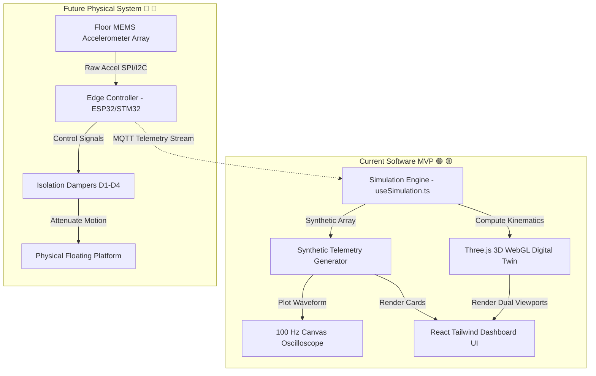

# ESDS — Earthquake-Resilient Dialysis Safety System
## Protecting the patient. Stabilizing the machine. Preserving treatment continuity.

[](https://sih.gov.in/)
[](#-project-status-dashboard)
[](#-software-architecture--tech-stack)
[](#-target-users--applications)

---

> ### ⚠️ OFFICIAL COMPLIANCE DISCLAIMER
> **ESDS is currently a software MVP and conceptual engineering proposal.**  
> The earthquake signals, sensor telemetry, motion calculations, isolation performance metrics, and 3D visual responses rendered in the digital twin are **computationally simulated parameters created for concept visualization**. The software is **not connected to, nor controlling, physical hardware or medical equipment**. ESDS is **not a certified medical device** and has not undergone physical shake-table validation or clinical testing. Any future physical deployment would require extensive structural, mechanical, electrical, biomedical, safety, regulatory, and clinical validation.

---

## 📌 At a Glance

| Aspect | Details |
| :--- | :--- |
| **Problem** | Earthquake-induced motion risk to hemodialysis patients connected to stationary equipment |
| **Solution** | Integrated seismic sensing, edge detection, isolation control, and WebGL digital twin architecture |
| **Current Software MVP** | Interactive 3D WebGL Digital Twin & Seismic Kinematics Simulator |
| **Physical Hardware** | 🔵 Proposed future implementation (MEMS accelerometers, edge MCU, MR/elastomeric isolators) |
| **Core Innovation** | Healthcare-specific seismic isolation concept combined with real-time digital twin monitoring |
| **Current Validation** | 🟢 Implemented software simulation & UI validation |
| **Physical Validation** | 🔴 Future work (Requires shake-table & clinical laboratory testing) |
| **Target Users** | Dialysis centers, hospitals, emergency healthcare facilities in seismic-prone regions |

### Executive Summary for Evaluators & SIH Judges
The **Earthquake-Resilient Dialysis Safety System (ESDS)** addresses a critical gap in hospital disaster preparedness: protecting chronic hemodialysis patients and high-value medical consoles during seismic events. During hemodialysis, patients remain physically tethered to a blood purification console for 3–4 hours per session via vascular access blood lines. Unmitigated ground acceleration can cause machines to slide or overturn, introducing severe mechanical tension on blood tubing.

ESDS proposes a layered seismic protection system that combines floor acceleration sensing, edge decision logic, a mechanical isolation layer, and a real-time **Three.js WebGL Digital Twin**. The current **Software MVP** demonstrates this engineering concept by rendering a live, side-by-side comparative simulation of an **UNPROTECTED (WITHOUT ESDS)** environment versus a **PROTECTED (WITH ESDS)** environment under identical simulated earthquake inputs.

---

## 📌 Classification Legend

Every technical feature, capability, and parameter in this report is categorized using the following status markers:

- 🟢 **`[IMPLEMENTED]`**: Features fully functional and verifiable in the current software source code repository.
- 🟡 **`[SIMULATED]`**: Implemented digitally for demonstration, but calculated via software equations rather than physical hardware.
- 🔵 **`[PROPOSED]`**: Engineering designs, candidate architectures, or hardware specifications planned for physical prototyping.
- 🔴 **`[NOT VALIDATED]`**: Target engineering metrics requiring physical laboratory or clinical testing.

---

## 📊 Current Software MVP vs. Future Physical System

| Capability | Current Software MVP 🟢 🟡 | Future Physical System 🔵 🔴 |
| :--- | :--- | :--- |
| **Project Status** | Software Concept Demonstration 🟢 | Physical Prototype & Hardware Rig 🔵 |
| **Earthquake Input** | Computational Wave Equation (Sum of Sines) 🟡 | Real Ground Motion / Shake Table 🔵 |
| **Seismic Sensor Data** | Simulated Telemetry Loop (`useSimulation.ts`) 🟡 | Physical MEMS / Industrial IMU Sensors 🔵 |
| **Digital Twin Engine** | Interactive Three.js / WebGL Rendering 🟢 | Hardware-Synchronized Telemetry Twin 🔵 |
| **Pod & Equipment Motion** | Procedural 3D Mesh Kinematics 🟢 | Physical Mechanical Isolation Platform 🔵 |
| **Seismic Isolation** | Illustrative $85\%$ Software Attenuation Factor 🟡 | Physical Dampers & Isolators 🔴 |
| **Isolation Actuation** | Animated Isolator Pistons ($D1$–$D4$) 🟢 | Active/Passive Dampers or Servos 🔵 |
| **Signal Detection** | TypeScript Logic & Thresholding 🟢 | Embedded Real-Time MCU Firmware (ESP32/STM32) 🔵 |
| **Vibration Waveform** | HTML5 Canvas $100 \text{ Hz}$ Oscilloscope 🟢 | Real Sensor Telemetry Stream 🔵 |
| **Patient & Console** | 3D Procedural Mesh Representations 🟢 | Physical Dialysis Bed & Hemodialysis Console 🔵 |
| **Validation Level** | Software Demonstration 🟢 | Laboratory + Shake-Table Testing 🔴 |

---

## 1. Problem Statement

During an earthquake, seismic waves propagate ground acceleration into building structures, causing unanchored furniture, equipment, and structural elements to vibrate, shift, or overturn.

```
┌──────────────────────────────────────────────────────────────────────────────────┐
│                             CONVENTIONAL DIALYSIS SETUP                          │
│                                                                                  │
│   SEISMIC INPUT ──► HOSPITAL FLOOR ──► MACHINE DISPLACEMENT ──► TUBING TENSION   │
│                                                                                  │
│                               POTENTIAL RISKS:                                   │
│          • Dialysis Console Sliding / Tipping Risk                               │
│          • Tubing Stress & Vascular Access Displacement Risk                     │
│          • Treatment Interruption & Staff Emergency Overload                     │
└──────────────────────────────────────────────────────────────────────────────────┘
```

### Potential Risks in Hemodialysis Environments

1. **Patient Mobility Constraint**: Hemodialysis patients are seated or reclining with blood lines inserted into an Arteriovenous (AV) Fistula, graft, or central venous catheter. Rapid evacuation during a tremor is physically impossible without performing an emergency blood-line disconnect.
2. **Equipment Mass & Dimensions**: Hemodialysis machines are tall, top-heavy units weighing $80–120 \text{ kg}$. Lateral ground acceleration can cause machines to slide across tile floors or tilt, risking collisions with wall infrastructure or fluidic line rupture.
3. **Relative Motion Mechanical Tension**: Differential movement between a moving machine console and a stationary patient bed can create sudden mechanical tension on blood tubing.
4. **Staff Emergency Workload**: Clinical staff must manage patient panic, evaluate building safety, and perform emergency procedures simultaneously during tremors.

### Why Existing Hospital Safety Measures Are Not Enough

Building-level seismic codes (such as IS 1893) focus on primary structural integrity—preventing building collapse. However, structural survival does not guarantee that internal equipment remains stationary. Conventional hospital practices rely on static wall anchors or manual wheel locks, which do not actively absorb kinetic energy or mitigate vibration transmitted to patients.

---

## 2. Our Solution & Core Idea

ESDS proposes a specialized **healthcare seismic isolation and monitoring platform**:

```
EARTHQUAKE GROUND MOTION
        │
        ▼
[ SENSE ] ───────── 🔵 Proposed MEMS Accelerometers (100 Hz Floor Measurement)
        │
        ▼
[ DETECT ] ──────── 🟢 Implemented Threshold Check (>0.25g) & Pump Noise Filtering
        │
        ▼
[ ISOLATE ] ─────── 🟡 Simulated 85% Motion Attenuation / 🔵 Proposed Isolators
        │
        ▼
[ STABILIZE ] ───── 🟢 Controlled 3D Mesh Kinematics / 🔵 Proposed Physical Platform
        │
        ▼
[ MONITOR ] ─────── 🟢 Implemented Three.js WebGL Digital Twin & 100 Hz Waveform
        │
        ▼
[ PROTECT ] ─────── 🟢 Patient Safety Zone Concept Visualization
```

### End-to-End Conceptual Workflow

1. **NORMAL MONITORING STATE**: System runs in baseline state. WebGL Digital Twin renders normal baseline telemetry.
2. **SEISMIC MOTION INITIATION**: Simulated ground acceleration begins.
3. **THRESHOLD DETECTION**: Software logic detects acceleration exceeding the $0.25\text{g}$ safety threshold.
4. **EVENT IDENTIFICATION**: Signal processing distinguishes low-frequency seismic waves ($0.5–10 \text{ Hz}$) from high-frequency dialyzer pump noise ($20–30 \text{ Hz}$).
5. **ISOLATION RESPONSE**: In the software MVP, the protected pod engages isolator pistons ($D1$–$D4$) and attenuates motion by an illustrative $85\%$.
6. **DIGITAL TWIN VISUALIZATION**: The WebGL engine displays live side-by-side motion contrast between unprotected and protected pods.
7. **SECURE RESTORATION**: Upon seismic cessation, damping lerps back to neutral rest state.

---

## 3. Why Hemodialysis Is a Special Case

Hemodialysis presents a unique biomedical engineering challenge compared to general hospital equipment:

- **Continuous Extracorporeal Blood Circuit**: Patients have $300–500 \text{ mL}$ of their blood outside their body passing through plastic lines and a dialyzer filter at flow rates of $300–450 \text{ mL/min}$.
- **Long Session Duration**: Treatment lasts 3 to 4 hours per session, during which patients cannot quickly move or disconnect.
- **Top-Heavy Fluidic Consoles**: Dialysis machines contain internal fluid reservoirs, dialysate heaters, and pumps, elevating their center of gravity.
- **Vascular Access Vulnerability**: Vascular access points (AV fistulas) are sensitive to mechanical pull or displacement.

*Conclusion*: A dedicated protection layer designed specifically around the dialysis bed-and-machine unit is justified to mitigate these mechanical interactions.

---

## 4. CURRENT MVP — WHAT WE HAVE ACTUALLY BUILT 🟢 🟡

An audit of the repository (`src/App.tsx`, `DialysisDigitalTwin.tsx`, `useSimulation.ts`, `VibrationChart.tsx`) reveals the following implemented capabilities:

```
┌──────────────────────────────────────────────────────────────────────────────────┐
│                             SOFTWARE MVP ARCHITECTURE                            │
│                                                                                  │
│   [Vite / React Dashboard] ──► [useSimulation Hook] ──► [Three.js 3D Digital Twin]│
│            │                             │                         │             │
│            ▼                             ▼                         ▼             │
│   [Controls & Presets]         [Synthetic Telemetry]     [Dual Compare Views]    │
└──────────────────────────────────────────────────────────────────────────────────┘
```

### Detailed Feature Classification Audit

1. 🟢 **Interactive Three.js 3D Digital Twin** (`DialysisDigitalTwin.tsx`):
   - WebGL 3D rendering of protective capsule frame, transparent glass canopy shell (`MeshPhysicalMaterial`), bed, 3D procedural anatomical human patient, hemodialysis console, saline/blood bags, filter cylinder, curved blood lines, and ADXL345 sensor representation.
2. 🟢 **Split-Screen Compare Mode** (`DialysisDigitalTwin.tsx`):
   - Renders two live 3D WebGL scenes side-by-side in real time: **WITHOUT ESDS (UNPROTECTED)** on the left vs. **WITH ESDS (PROTECTED)** on the right.
3. 🟢 **Seismic Kinematics Engine** (`DialysisDigitalTwin.tsx`):
   - Multi-harmonic wave generator computing real-time mesh displacement without erratic random jitter.
4. 🟢 **Smooth Lerp Damping & Ramp** (`DialysisDigitalTwin.tsx`):
   - Fast $0.3\text{s}$ lerp ramp-up on activation and $0.5\text{s}$ damped return to neutral `(0, 0, 0)` upon reset.
5. 🟢 **Live Vibration Waveform Oscilloscope** (`VibrationChart.tsx`):
   - HTML5 Canvas plotting dynamic acceleration at $100 \text{ Hz}$ against a $0.25\text{g}$ threshold line.
6. 🟢 **Sensor Telemetry Panel** (`SensorTelemetry.tsx`):
   - UI metrics displaying dynamic acceleration $(g)$, vibration intensity $(\%)$, floor motion $(\%)$, pod motion $(\%)$, and risk status.
7. 🟢 **Automated Safety State Machine** (`SafetyStateMachine.tsx`):
   - 5-step visual pipeline (`MONITOR` $\rightarrow$ `DETECT` $\rightarrow$ `ISOLATE` $\rightarrow$ `PROTECT` $\rightarrow$ `SECURE`).
8. 🟢 **False Positive Demo** (`FalsePositiveDemo.tsx`):
   - Interactive filtering demonstration distinguishing dialyzer pump vibration from low-frequency seismic waves.
9. 🟡 **Synthetic Telemetry Generator** (`useSimulation.ts`):
   - Mathematical telemetry generator outputting synthetic sensor arrays every $30 \text{ ms}$ for demonstration purposes.

---

## 5. How a Judge Can Test the MVP (60-Second Demo Script)

To evaluate the software MVP during SIH judging, follow this testing sequence:

```
┌─────────────────────────────────────────────────────────────────────────────────┐
│                           60-SECOND JUDGING DEMO SCRIPT                         │
│                                                                                 │
│  [0-10s] Observe Baseline ──► [10-20s] Toggle Compare ──► [20-35s] Start Sim   │
│                                                                        │        │
│  [55-60s] Click Reset     ◄── [45-55s] Check Waveform   ◄── [35-45s] Contrast   │
└─────────────────────────────────────────────────────────────────────────────────┘
```

### Step-by-Step Test Procedure

1. **0–10 sec (Baseline State)**: Open application. Observe both pods in stationary rest state (`SYSTEM NORMAL`, $0\text{g}$ dynamic acceleration).
2. **10–20 sec (Enable Compare Mode)**: Click **🔀 COMPARE ESDS (SPLIT SCREEN)** in the top header to render side-by-side viewports.
3. **20–35 sec (Configure Intensity)**: Drag the Intensity slider to **55% (MODERATE)** or **88% (SEVERE)** and click **⚡ SIMULATE EARTHQUAKE**.
4. **35–45 sec (Observe 3D Motion Contrast)**:
   - **LEFT POD (UNPROTECTED)**: Observe high-amplitude horizontal shaking ($1.8 \times \text{floorX}$) and high-frequency vibration jitter.
   - **RIGHT POD (PROTECTED)**: Observe stable, attenuated motion ($0.15 \times \text{floorX}$) with isolator pistons $D1$–$D4$ compressing in phase.
5. **45–55 sec (Inspect Telemetry & Waveform)**: Observe the $100 \text{ Hz}$ live waveform crossing the $0.25\text{g}$ threshold line and the 5-step safety state machine progressing to `PROTECT` / `SECURE`.
6. **55–60 sec (Reset System)**: Click **RESET**. Observe both 3D pod models lerping back smoothly to neutral `(0, 0, 0)` rest position.

---

## 6. Protected vs. Unprotected Comparison Analysis 🟡 🔴

In **Compare Mode**, ESDS models two distinct mechanical responses:

```
┌───────────────────────────────────────┬───────────────────────────────────────┐
│     WITHOUT ESDS (UNPROTECTED) 🟡     │       WITH ESDS (PROTECTED) 🟡        │
│                                       │                                       │
│   • Pod Motion: HIGH (e.g. 47%)       │   • Pod Motion: LOW (e.g. 7%)         │
│   • Simulated Vibration: Unmitigated  │   • Simulated Vibration: Attenuated   │
│   • Dampers: Disabled (OFF)           │   • Dampers: Active (D1-D4 Engaged)   │
│   • Visual State: High Motion Risk    │   • Visual State: Stabilized Pod      │
└───────────────────────────────────────┴───────────────────────────────────────┘
```

### Motion Differential Explanation 🟡
- **Unprotected Model (Left)**: Simulates an unanchored setup where ground acceleration passes directly into the structure ($100\%$ motion tracking + high-frequency kinetic vibration).
- **Protected Model (Right)**: Applies an illustrative software attenuation factor of $0.15$ ($85\%$ reduction), representing the conceptual effect of an isolation platform.

*Important Note*: This visual contrast demonstrates the engineering concept in software and does **NOT** constitute experimentally measured physical performance results. 🟡 🔴

---

## 7. Digital Twin Architecture

```
CURRENT SOFTWARE MVP:
[ Simulation Engine (useSimulation.ts) ] ──► [ Three.js WebGL Engine ] ──► [ Dashboard UI ]

FUTURE PHYSICAL SYSTEM:
[ MEMS Accelerometer Array ] ──► [ Edge MCU ] ──► [ Telemetry Stream ] ──► [ Three.js WebGL Twin ]
```

### Why a WebGL Digital Twin?
1. **Real-Time Visual Monitoring**: Enables hospital clinical control rooms to monitor physical pod stability remotely.
2. **Post-Event Diagnostics**: Provides visual playback of structural displacement during tremors.
3. **Future Sensor Integration Interface**: Designed to substitute synthetic telemetry streams with real MQTT/WebSocket sensor streams upon physical hardware deployment.

---

## 8. Software Kinematics Engine Equations 🟡

The animation loop in `DialysisDigitalTwin.tsx` calculates 3D mesh displacement using deterministic equations:

### Multi-Harmonic Wave Generator
$$\text{Wave}(t) = 0.45 \sin(18t) + 0.25 \sin(31t) + 0.12 \sin(47t)$$

### Unprotected Left Pod Motion
$$A_{\text{floor}} = \max\left(0.35, \frac{\text{FloorMotion}}{100} \cdot 2.0\right) \cdot R(t)$$

$$X_{\text{unprotected}}(t) = 1.8 \cdot \text{Wave}(t) \cdot A_{\text{floor}} + \left(0.35 \sin(36t) + 0.22 \cos(54t)\right) A_{\text{floor}}$$

$$Y_{\text{unprotected}}(t) = \left(0.20 \sin(42t) + 0.12 \cos(26t)\right) A_{\text{floor}}$$

$$\Theta_{\text{unprotected}}(t) = \left(0.10 \sin(28t) + 0.06 \cos(46t)\right) A_{\text{floor}}$$

### Protected Right Pod Motion
$$X_{\text{protected}}(t) = 0.15 \cdot \text{Wave}(t) \cdot A_{\text{floor}}, \quad Y_{\text{protected}}(t) = 0, \quad \Theta_{\text{protected}}(t) = 0$$

*Note: These equations are computational simulation parameters used for MVP rendering and are not physical sensor measurements.* 🟡

---

## 9. System Architecture & Component Flow



---

## 10. Proposed Future Physical Hardware Architecture 🔵

> *Notice: All components in this section represent proposed candidate technologies for future hardware development and are NOT physically built into the current software codebase.*

```
┌─────────────────────────────────────────────────────────────────────────────────┐
│                    PROPOSED PHYSICAL HARDWARE STACK                             │
│                                                                                 │
│   [MEMS / IMU SENSORS] ──► [ESP32 / STM32 MCU] ──► [ISOLATION ACTUATORS]       │
│      (ADXL345 / MPU6050)      (Edge Controller)    (MR Dampers / Servos / Rubber)│
└─────────────────────────────────────────────────────────────────────────────────┘
```

### Candidate Technology Evaluation Matrix 🔵 🔴

| Subsystem | Candidate Technologies | Primary Function | Candidate Rationale | Limitations / Validation Required 🔴 |
| :--- | :--- | :--- | :--- | :--- |
| **Seismic Sensor** | ADXL345, MPU6050, Industrial MEMS IMU | Floor acceleration measurement | High sampling rate ($100+\text{ Hz}$), low cost, SPI/$I^2C$. | Calibration against reference shake-table sensors required. |
| **Edge MCU** | ESP32-WROOM, STM32F4, Industrial PLC | Sensor thresholding & signal processing | Low latency, processing capacity, communication interfaces. | Deterministic RTOS scheduling verification required. |
| **Fieldbus Comms** | CAN Bus 2.0B, RS-485, Industrial Ethernet | Interconnect between MCU & damper drivers | Noise-immune in clinical environments. | EMC compliance and cable routing validation required. |
| **Isolation Actuators** | Magnetorheological (MR) Dampers, Servos, Rubber Isolators | Kinetic energy absorption | Variable damping under magnetic fields (MR dampers). | High cost, power consumption, and seal durability testing required. |

---

## 11. Mechanical & Isolation Design Concept 🔵 🔴

```
  ┌─────────────────────────────────────────────────────────────┐
  │                 ISOLATED UPPER PLATFORM                     │  ◄── Supports Pod & Equipment
  └─────────────────────────────────────────────────────────────┘
     ▲              ▲                         ▲              ▲
     │              │                         │              │
  [D1 Mount]    [D2 Mount]                 [D3 Mount]    [D4 Mount]  ◄── Mechanical Isolators
     │              │                         │              │
  ┌─────────────────────────────────────────────────────────────┐
  │                   HEAVY STEEL BASE FRAME                    │  ◄── Anchored Base
  └─────────────────────────────────────────────────────────────┘
```

### Engineering Design Targets (Proposed) 🔵 🔴
- **Natural Frequency ($\omega_n$)**: Target $< 1.5 \text{ Hz}$ to ensure isolation for ground motion above $3 \text{ Hz}$. 🔴
- **Overturning Stability**: Wide base footprint ($11.5 \text{ ft} \times 5.5 \text{ ft}$) designed to prevent tipping under lateral loads up to $1.2\text{g}$. 🔴
- **Tubing Conduit Relief**: Flexible conduit loop accommodating up to $\pm 150 \text{ mm}$ of lateral displacement without straining wall supply connections. 🔴
- **Fail-Safe Mechanical Stops**: Solenoid-actuated pins defaulting to locked position upon power loss. 🔴

---

## 12. Failure Mode & Safety Analysis (FMEA) 🔵 🔴

| Failure Mode | Potential Risk | Proposed Mitigation Strategy 🔵 | Required Validation 🔴 |
| :--- | :--- | :--- | :--- |
| **Sensor Failure** | Signal loss or false reading. | Triple-modular redundant (TMR) sensor voting logic. | Fault-injection bench testing. |
| **Power Failure** | Loss of active control signal. | Solenoid locks default actuators to passive mechanical damping mode. | Power-loss physical simulation. |
| **Excessive Motion** | Ground displacement exceeds limit. | Elastomeric bumper stops absorb end-of-stroke impact. | High-amplitude stroke table testing. |
| **MCU Lockup** | Controller stops responding. | Hardware watchdog timer triggers hardware reset. | Long-term firmware reliability testing. |

---

## 13. Comprehensive Validation Plan & Roadmap

Physical validation of ESDS requires an 8-stage engineering roadmap:

```
┌──────────────────┐     ┌──────────────────┐     ┌──────────────────┐     ┌──────────────────┐
│     STAGE 1      │     │     STAGE 2      │     │     STAGE 3      │     │     STAGE 4      │
│   Software MVP   │ ──► │ Bench Scale Rig  │ ──► │ Full Scale Platform │ ─► │ Non-Clinical Pilot│
│ WebGL Twin 🟢    │     │ Shake Table 🔵   │     │ Simulated Loads 🔵│     │ Hospital Test 🔴 │
└──────────────────┘     └──────────────────┘     └──────────────────┘     └──────────────────┘
```

### Stage Breakdown

- **Stage 1 — Software MVP (Current)** 🟢: WebGL 3D Digital Twin, synthetic telemetry loop, comparative UI dashboard.
- **Stage 2 — Bench Scale Prototype** 🔵: 1:4 scale physical rig on a 2-axis shake table with ESP32 MCU and accelerometers.
- **Stage 3 — Full-Scale Shake-Table Testing** 🔵: Full-scale physical platform tested under simulated seismic wave records (e.g. El Centro 1940, Bhuj 2001).
- **Stage 4 — Engineering & Structural Validation** 🔴: Verification of transmissibility ($T < 0.20$), natural frequency tuning, and overturning resistance.
- **Stage 5 — Compliance Evaluation** 🔴: Assessment against **IEC 60601-1** (Medical electrical equipment safety) and **IS 1893** (Seismic design standards).
- **Stage 6 — Non-Clinical Hospital Trial** 🔴: Operational pilot using dummy mass loads in a hospital environment.

---

## 14. Performance Metrics (Simulated vs. Target)

| Metric | Current Software MVP 🟡 | Proposed Physical Target 🔵 🔴 |
| :--- | :--- | :--- |
| **Peak Dynamic Acceleration** | Simulated parameter ($0.03\text{g} – 0.95\text{g}$) 🟡 | Measured via MEMS accelerometer 🔴 |
| **Transmissibility ($T$)** | Illustrative $0.15$ multiplier ($85\%$ reduction) 🟡 | Target $T < 0.20$ ($>80\%$ reduction) 🔴 |
| **Detection Threshold** | $0.25\text{g}$ dynamic acceleration 🟢 | Configurable firmware threshold ($0.20\text{g} – 0.30\text{g}$) 🔵 |
| **Detection Latency** | Simulated $38 \text{ ms}$ indicator 🟡 | Sub-20ms RTOS processing target 🔴 |
| **Sampling Frequency** | $100 \text{ Hz}$ simulated stream 🟢 | $100 \text{ Hz} – 500 \text{ Hz}$ SPI/I2C sensor read 🔵 |

---

## 15. Indicative Prototype Budget 🔵 🔴

> *Notice: Costs represent preliminary engineering estimates for physical prototype fabrication and must be confirmed through component sourcing.* 🔵 🔴

| Subsystem | Components | Est. Cost Range (INR) | Est. Cost Range (USD) |
| :--- | :--- | :--- | :--- |
| **Structural Frame** | Base plate & upper deck structural steel | ₹25,000 – ₹40,000 | $300 – $480 |
| **Mechanical Isolators** | Viscous / elastomeric isolator mounts (x4) | ₹30,000 – ₹60,000 | $360 – $720 |
| **Sensing Package** | Dual MEMS accelerometers + signal conditioning | ₹4,000 – ₹8,000 | $50 – $100 |
| **Edge Controller** | ESP32 / STM32 breakout board & relay drivers | ₹3,000 – ₹6,000 | $35 – $75 |
| **Power Management** | Battery backup (UPS) & power supplies | ₹8,000 – ₹15,000 | $100 – $180 |
| **Fabrication & Testing** | Machining, welding, and bench calibration | ₹15,000 – ₹25,000 | $180 – $300 |
| **ESTIMATED TOTAL** | **Single Prototype Unit** | **₹85,000 – ₹1,54,000** | **~$1,025 – $1,855** |

---

## 16. Target Users & Scalability Beyond Dialysis

### Primary Target Users
- **Dialysis Centers & Hospitals**: Facilities operating in seismic Zone IV and Zone V regions.
- **Disaster-Resilient Medical Facilities**: Field hospitals and emergency care modules requiring equipment stabilization.

### Scalability to Other Clinical Environments 🔵
The core ESDS concept—combining base isolation with real-time digital twin monitoring—can potentially adapt to other vibration-sensitive medical setups:
- Intensive Care Unit (ICU) ventilator beds 🔵
- Neonatal incubator stations 🔵
- Operating room surgical navigation consoles 🔵
- Precision laboratory centrifuges and mass spectrometers 🔵

---

## 17. Innovation & SIH Value Proposition

1. **Healthcare-Specific Isolation Concept**: Tailors seismic protection specifically around hemodialysis equipment and patient safety constraints.
2. **Integrated Digital Twin**: Combines physical isolation concepts with a WebGL Digital Twin control dashboard.
3. **Interactive Visual Comparison**: Demonstrates UNPROTECTED vs. PROTECTED behaviors side-by-side in real time.
4. **False Positive Filtering Concept**: Differentiates routine dialyzer pump vibration ($20–30 \text{ Hz}$) from low-frequency seismic waves ($0.5–10 \text{ Hz}$).
5. **Clear Development Roadmap**: Defines a logical progression from software MVP to bench-scale prototype and shake-table testing.

---

## 18. Limitations & Constraints 🔴

1. **Software-Only MVP**: The repository contains no physical hardware, physical accelerometers, or shake-table test data. 🟢
2. **Synthetic Telemetry Data**: Telemetry metrics, waveforms, and motion values are computationally generated for demonstration. 🟡
3. **Non-Clinical Software**: ESDS is a conceptual software demonstration and is not certified for clinical use or medical decision-making. 🔴
4. **Physical Engineering Required**: Structural load limits, natural frequency tuning, and isolator selection require physical prototyping and laboratory validation. 🔵 🔴

---

## 19. Key Engineering Questions for Physical Deployment 🔵 🔴

Before fabricating a physical prototype, several key engineering questions must be evaluated through laboratory testing:
- What isolation natural frequency ($\omega_n$) provides optimal motion reduction without excessive lateral sway? 🔴
- How should flexible umbilical blood lines and water supply lines be routed to prevent strain during maximum platform displacement? 🔴
- Which actuator technology (passive elastomeric vs. semi-active MR dampers) offers the most reliable cost-to-performance ratio? 🔴
- What fail-safe mechanical locking mechanism best ensures stability during total electrical power failure? 🔴

---

## 20. Project Status Dashboard

| Component / Subsystem | Current Status | Description |
| :--- | :--- | :--- |
| **React Dashboard UI** | 🟢 `[IMPLEMENTED]` | Responsive light medical theme dashboard (`App.tsx`). |
| **Three.js 3D Digital Twin** | 🟢 `[IMPLEMENTED]` | Interactive WebGL rendering of pod, bed, patient, and machine. |
| **Split-Screen Compare Mode** | 🟢 `[IMPLEMENTED]` | Live side-by-side WebGL viewports for UNPROTECTED vs PROTECTED. |
| **Kinematics Wave Engine** | 🟢 `[IMPLEMENTED]` | Multi-harmonic wave equations driving 3D mesh displacement. |
| **100 Hz Canvas Oscilloscope** | 🟢 `[IMPLEMENTED]` | HTML5 Canvas real-time acceleration waveform display. |
| **Synthetic Sensor Telemetry** | 🟡 `[SIMULATED]` | Telemetry loop outputting synthetic metrics (`useSimulation.ts`). |
| **Physical Accelerometer** | 🔵 `[PROPOSED]` | Proposed MEMS / IMU hardware sensor integration. |
| **Physical Isolation Platform** | 🔵 `[PROPOSED]` | Proposed steel platform and isolator mounts. |
| **Shake-Table Validation** | 🔴 `[NOT VALIDATED]` | Physical vibration laboratory testing. |
| **Clinical Safety Validation** | 🔴 `[NOT VALIDATED]` | Clinical safety evaluation and regulatory certification. |

---

## 21. Repository Structure 🟢

```
d:\sih\
├── public/
│   └── vite.svg
├── src/
│   ├── components/
│   │   ├── AlertPanel.tsx            # Floating emergency alert notification banner
│   │   ├── ArchitecturePanel.tsx     # Technical architecture overview panel
│   │   ├── DecisionEngine.tsx        # Risk scoring & threshold decision metrics
│   │   ├── DialysisDigitalTwin.tsx   # Three.js WebGL 3D Digital Twin & Kinematics Engine
│   │   ├── EarthquakeSimulator.tsx   # Controls panel (Intensity slider, scenario presets)
│   │   ├── EventTimeline.tsx         # System event log timeline display
│   │   ├── FalsePositiveDemo.tsx     # Dialyzer pump frequency filtering demo
│   │   ├── Header.tsx                # Dashboard header & Compare Mode toggle button
│   │   ├── RecoveryModal.tsx         # Simulation summary recovery modal
│   │   ├── SafetyStateMachine.tsx    # 5-Step visual safety pipeline bar
│   │   ├── SensorTelemetry.tsx       # Telemetry cards (Dynamic acceleration, motion %)
│   │   └── VibrationChart.tsx        # HTML5 Canvas 100 Hz real-time oscilloscope
│   ├── hooks/
│   │   └── useSimulation.ts          # Central state management & synthetic telemetry loop
│   ├── types/
│   │   └── esds.ts                   # TypeScript interfaces & state declarations
│   ├── App.tsx                       # Main dashboard container layout
│   ├── index.css                     # Tailwind CSS styles & custom glass styling
│   └── main.tsx                      # React application entry point
├── package.json                      # Node.js dependencies & scripts
├── tailwind.config.js                # Light medical theme color palette configuration
├── tsconfig.json                     # TypeScript compiler configuration
├── vite.config.ts                    # Vite build tool configuration
└── README.md                         # Official SIH Technical & Innovation Project Report
```

---

## 22. Local Setup & Installation Instructions 🟢

### Prerequisites
- **Node.js**: v18.0.0 or higher
- **npm**: v9.0.0 or higher

### Step-by-Step Installation

1. **Clone or navigate to the repository**:
   ```bash
   cd d:\sih
   ```

2. **Install dependencies**:
   ```bash
   npm install
   ```

3. **Launch local development server**:
   ```bash
   npm run dev
   ```
   Open your browser at `http://localhost:5173`.

4. **Compile production build**:
   ```bash
   npm run build
   ```

5. **Preview production build locally**:
   ```bash
   npm run preview
   ```

---

## 23. Final SIH Vision & Conclusion

> **The Vision**: ESDS begins as an interactive software MVP demonstrating the concept of earthquake isolation and real-time WebGL monitoring for hemodialysis environments. The logical next step is a physical bench-scale prototype combining MEMS sensors, embedded microcontrollers, and mechanical isolators. The long-term goal is to engineer a validated, disaster-resilient healthcare safety platform capable of protecting vulnerable treatment environments during seismic emergencies.

---

*ESDS Protected Pod MVP v1.0 — Conceptual Healthcare Safety Software Report for Smart India Hackathon (SIH).*
